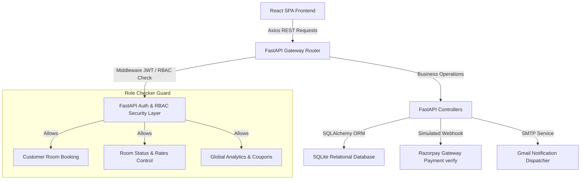
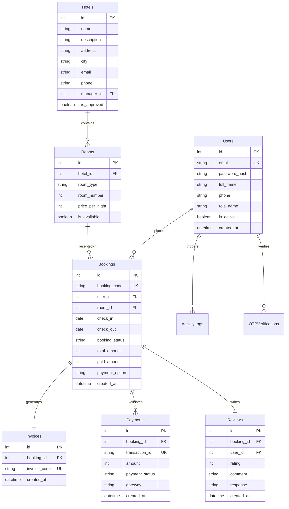

# Panun Ghar Luxury Resort | Full-Stack Booking Management Engine

A production-grade, secure, and fully responsive Full-Stack Hotel Booking Engine and Management Dashboard built for **Panun Ghar Luxury Resort** (Srinagar, Kashmir). 

This project simulates a complete, interview-ready enterprise booking system (resembling Goibibo or Booking.com) featuring JWT session authentication, OTP account verification, database transaction safeguards, Razorpay payment simulations, and email notifications.

---

## 🛠️ System Architecture



---

## 💾 Relational Database ERD Schema



---

## 🔒 Cybersecurity & Production Safeguards

1. **Relational Parameterization**: All database query evaluations use the SQLAlchemy ORM layer. This automatically parameterizes inputs, rendering **SQL Injection (SQLi) impossible**.
2. **Password Crypt Hashing**: User passwords are never saved raw. They are processed using **Bcrypt with 12 rounds of salt** to secure user databases.
3. **Session Token Expirations**: Uses double-token JWTs:
   - **Access Token**: Valid for 60 minutes.
   - **Refresh Token**: Valid for 30 days. Auto-issued via Axios response interceptors on expired 401s without disrupting the client checkout loop.
4. **Role-Based Access Controls (RBAC)**: Fine-grained FastAPI endpoint dependency injections verify that user roles match permitted scopes (`User`, `Manager`, `Admin`).
5. **OTP Verification Expiry**: Email activation codes are limited to a **10-minute lifespan** in SQLite.
6. **No Hardcoded Secrets**: All configs (secrets, tokens, SMTP servers) are parsed from a secure `.env` file using Pydantic.

---

## 🚀 Setup & Quickstart

Deploy the complete full-stack environment instantly using Docker Compose:

### 1. Build and run containers
```bash
docker-compose up --build
```

- **Frontend App**: Served at `http://localhost` (Nginx port 80).
- **Backend API Docs**: Served at `http://localhost:8000/docs` (FastAPI Swagger UI).

### 2. Manual Development Setup

If you prefer running the servers locally for active debugging:

**Backend Setup:**
```bash
cd backend
python -m venv venv
# On Windows
.\venv\Scripts\activate
pip install -r requirements.txt
python seed.py
uvicorn app.main:app --reload --port 8000
```

**Frontend Setup:**
```bash
cd frontend
npm install
npm run dev
```

---

## 👨‍💻 Project Ownership

- **Hotel Branding**: Panun Ghar Luxury Resort (Dal Lake, Srinagar, Kashmir)
- **Primary Owner**: Mir Furqaan
- **Primary Gmail**: `mirfurkaan106@gmail.com`
- **Contact Number**: `+91 7889984798`
